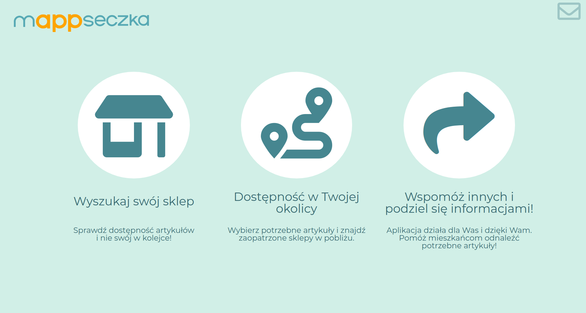
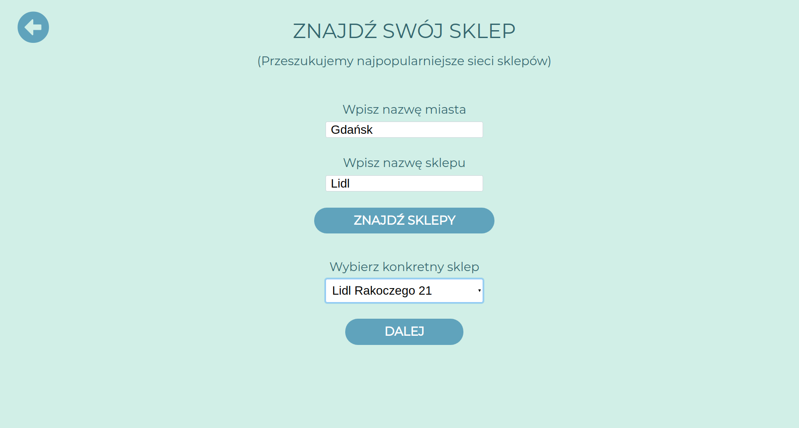
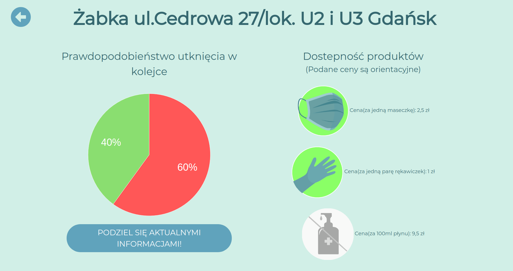
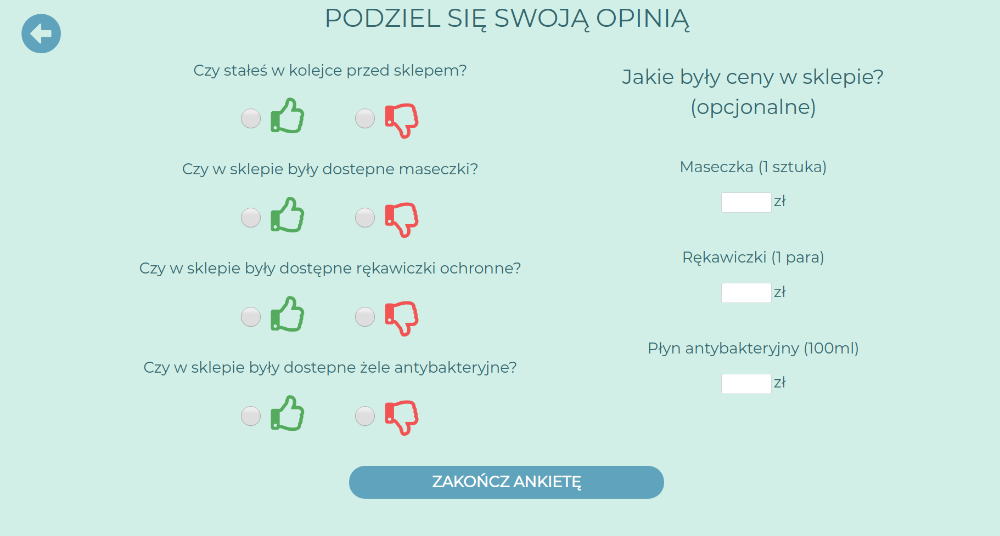
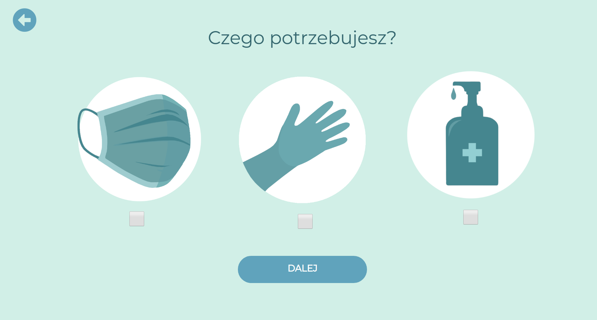
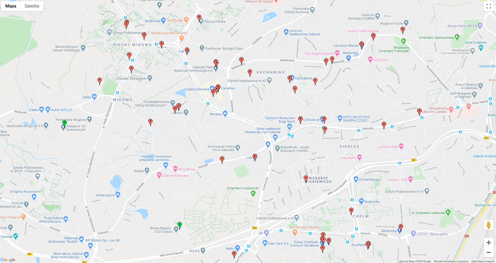
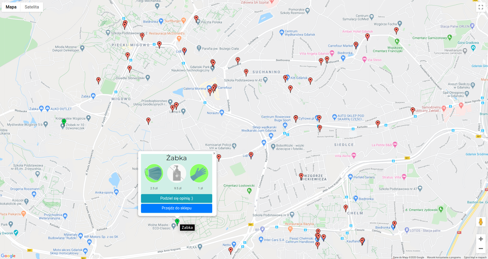

#  
> The application has been designed as a tool to check the availability and prices of sensitive products such as masks, gloves and antibacterial gels in stores and to check the risk of getting stuck in a queue in front of given stores.

## Table of contents
* [General info](#general-info)
* [Features](#features)
* [Technologies](#technologies)
* [Status](#status)
* [Inspiration](#inspiration)

## General info
>The main feature of the application is ability to check availability and prices of sensitive products. User can find his specific store or check all the stores in his neighbourhood. User can also share actual information about these dates. 
## Features
### Home page
 
>  Home page where the user has a choice to find his specific store, check availability of sensitive products in his neighbourhood or share actual information about store.

### Availability in specific store
 
> When user click to find his specific store he should find this shop with using autocomplete city searcher and then autocomplete store searcher. After that user gets list of these specific stores. 

### Store details 
 
>When the user finds his store, he can go into the details of this store and check the availability of all sensitive products, their prices and the percentage chance of getting stuck in a queue in front of the store at a given moment

### Questionnaire
 
>The user can share current information related to a given store by completing a short survey and answering 4 short questions. Additionally, the user can optionally enter the current price of the given products.

### Availability in your neighbourhood

> Users can also check available products in stores in their area. At the beginning he has to select what products he is looking for and then by sharing his location using google maps he will see his location and stores in the immediate area along with the availability and prices of products 

## Technologies
* Java SE 11
* Spring boot
* Hibernate ORM 5.4.2
* REST API
* Docker
* Tomcat
* Maven 3.3.9
* Freemarker 2.3.29
* Bootstrap 4.3.1
* HTML5, CSS3, JS
* jQuery, AJAX
* Postgres

## Status
Project is: _finished_.

## Inspiration
Own idea.